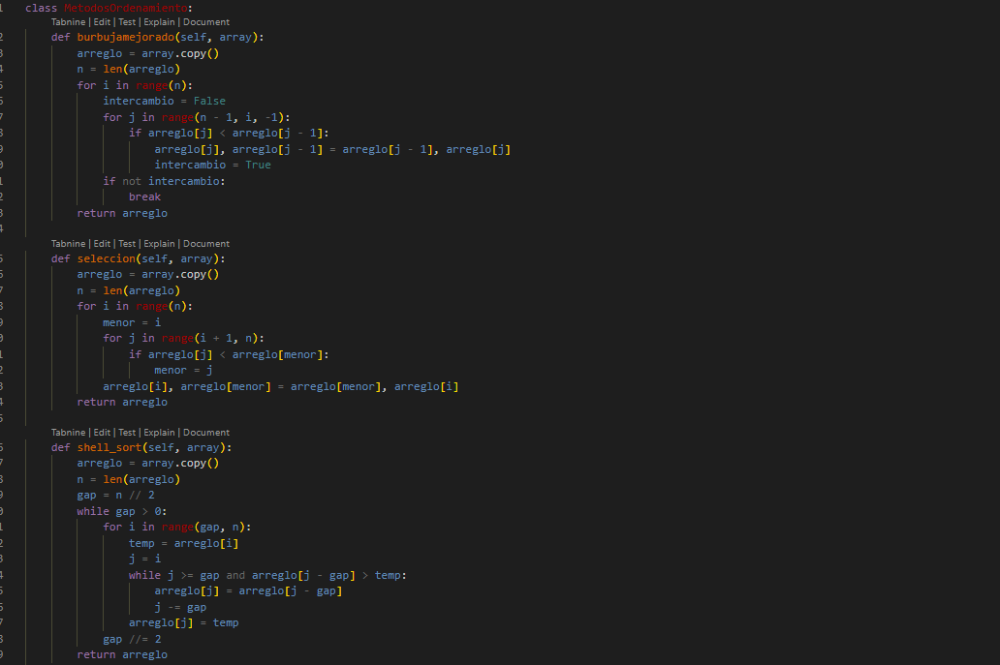
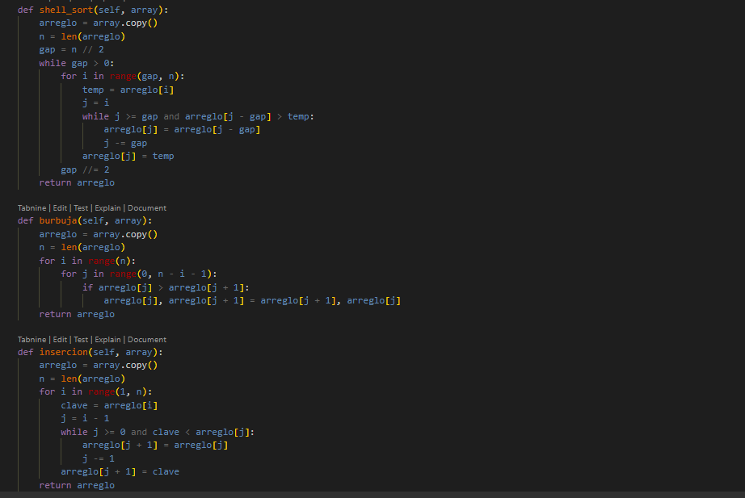
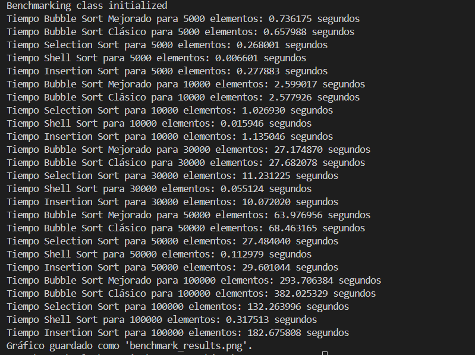
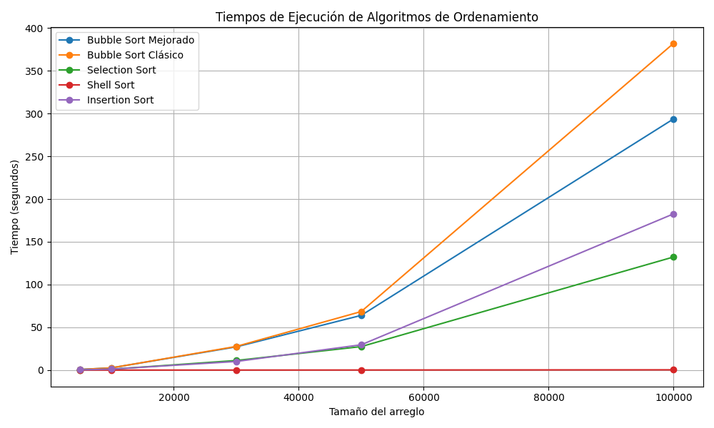

 # SEGUIR EL FORMATO  DE INFROME DE README

## EJEMPLO DE ADICIÓN DE DATOS EN ESTE INFORME

##  CONCLUCIONES CON TERMINOLOGIA DE NOTACION 

 - Se han evaluado varios algoritmos de ordenamiento, incluyendo Bubble Sort Mejorado, Bubble Sort Clásico, Selection Sort, Shell Sort e Insertion Sort. Se midieron los tiempos de ejecución para arreglos de diferentes tamaños (5,000; 10,000; 30,000; 50,000; 100,000 elementos) y se analizaron los resultados en terminos de eficiencia algoritmica utilizando la notacion Big-O.
## Conclusiones 
- los algoritmos de ordenamiento como Bubble Sort y Selection Sort tienen un rendimiento ineficiente con ( O(n^2) ), lo que los hace poco practicos para arreglos grandes. En contraste, Shell Sort, con su complejidad de ( O(n \log n) ) en el mejor caso, demuestra ser más eficiente y adecuado para conjuntos de datos más grandes.
- Para aplicaciones que requieren ordenamiento de grandes volemenes de datos, se recomienda utilizar algoritmos mas eficientes como Shell Sort o incluso algoritmos de ordenamiento más avanzados como Quick Sort o Merge Sort, que tienen un rendimiento promedio de ( O(n \log n) ).
- La elección del algoritmo de ordenamiento debe basarse en el tamaño del conjunto de datos y la naturaleza de los datos (si están casi ordenados o no). Para conjuntos de datos pequeños, metodos como Insertion Sort pueden ser mejores debido a su simplicidad y bajo costo de implementacion.